Examples
========

In this section we will present some examples for different datasets as well as some of the features of TRACMASS.

Theoretical (2D dataset)
------------------------

The theoretical is the default project of TRACMASS and describes the flow on a spatial homogeneous and time dependent two dimensional velocity field. The velocities are described by:

.. math::

      u(x,y,t) \equiv u(t)  &=  u_g \exp(-\gamma_g t) + (u_o-u_g) \exp(-\gamma t) \cos(f t)

      v(x,y,t) \equiv v(t)  &=  -(u_0-u_g) \exp(-\gamma t) \sin(f t)

We used the same coefficients as Fabbroni (2009) with :math:`$u_0 =$` 0.3 m/s, :math:`$u_g =$` 0.04 m/s, and a damping time :math:`$1/\gamma =$` 2.89 days and :math:`$1/\gamma_g =$` 28.9 days. The latitude was set to :math:`$ 45^\circ $` N. The velocities are read into TRACMASS every hour. TRACMASS was integrated forward in time using the time step method with intermediate steps so that the velocities were updated with linear interpolation between two time steps. The results are shown in the figure below, the small differences between the results from the truly analytical solution and the TRACMASS solution are likely due to the velocities are read every hour and not continuously.

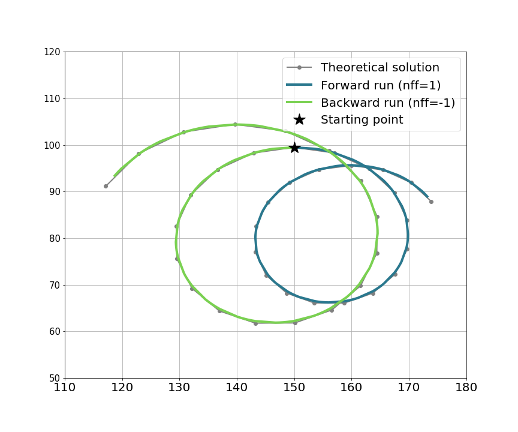

TRACMASS features: **iter** choice
^^^^^^^^^^^^^^^^^^^^^^^^^^^^^^^^^^

The results of TRACMASS are sensitive to the choice of **iter**. The higher value of **iter**, the more accurate the result of TRACMASS, however it will increase the computation time. The theoretical case is run with different **iter** values. As expected the highest value of **iter** is closer to the analytical solution while the deviation to the analytical solution becomes largest to the coarser case.

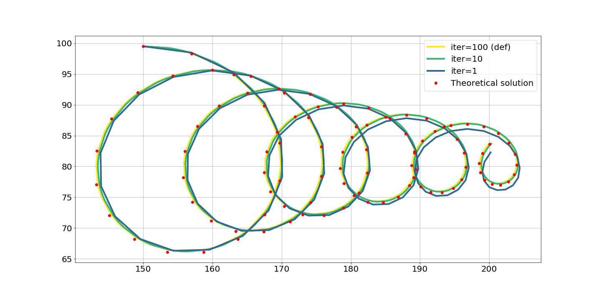

AVISO (2D dataset)
------------------

The AVISO data is stored on a Arakawa's B-grid while TRACMASS is defined on a Arakawa's C-grid. Therefore, both zonal and meridional fluxes are computed interpolating the velocity fields on the TRACMASS grid. This is done on the **read_field** subroutine. The default setup of this project initialises trajectories south of the Mozambique Channel only for southward fluxes (marked in red in the figure). The seeding takes place every day and ten trajectories are initialised in the location.

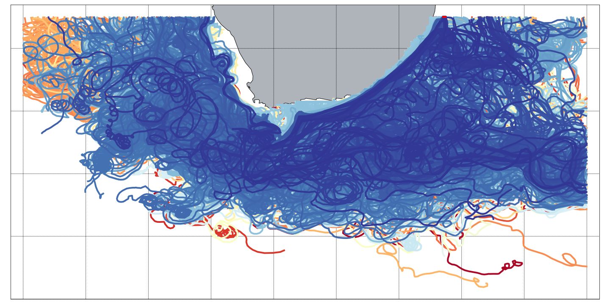

TRACMASS features: killing zones (**exitType==1**)
^^^^^^^^^^^^^^^^^^^^^^^^^^^^^^^^^^^^^^^^^^^^^^^^^^

Four killing zones have been imposed to this run: two zonal boundaries at each side of the southern tip of Africa, and two meridional boundaries (see figure below). By doing so, we can filter trajectories based on which boundary they are terminated. This information is stored in the *_rerun.csv* file. Please remember that **nend** = 0 is reserved to trajectories which have exceeded the time limit and **nend** = 1 is reserved to those trajectories that reach the surface.

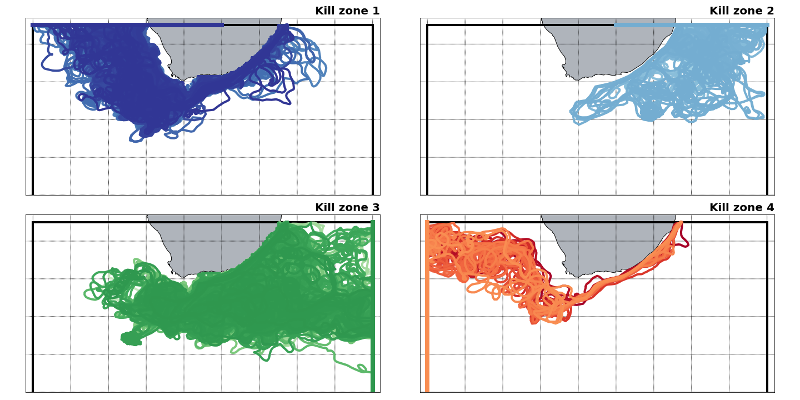

TRACMASS features: stream functions I (**psixy** - barotropic)
^^^^^^^^^^^^^^^^^^^^^^^^^^^^^^^^^^^^^^^^^^^^^^^^^^^^^^^^^^^^^^

If stream function calculation (**l_psi**) is activated, a stream function will be calculated to each of the killing zones. This way one is able to separate the total lagrangian barotropic stream function into the different components depending of the killing zone. All the stream functions showed in the figure below are computed offline and with **dirpsi** equal to one.

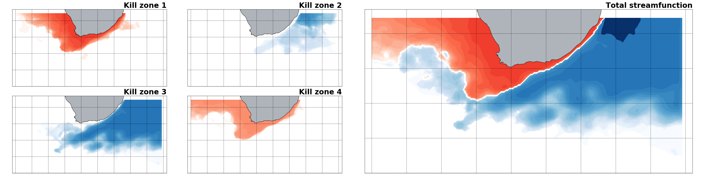

.. important:: The Lagrangian stream function may differ from the Eulerian stream function if the number of trajectories is not large enough.

TRACMASS features: **dzt** choice for 2-D simulations
^^^^^^^^^^^^^^^^^^^^^^^^^^^^^^^^^^^^^^^^^^^^^^^^^^^^^

The size of **dzt** in 2-D simulations (**w_2dim**) does not affect the calculation of trajectories in TRACMASS (see figure below). However, it will affect the volume/mass transport of the trajectories. Note that some trajectories may not be completely identical, but the mean paths are unaltered.

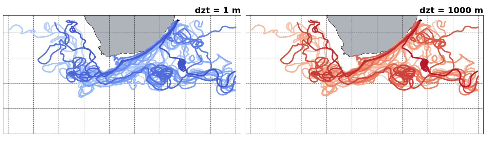

NEMO-ORCA1 (3D dataset)
-----------------------

The NEMO data is defined on the same grid as the  TRACMASS grid. Therefore, there is no need to interpolate velocities or tracer on the TRACMASS grid. The default setup of this project initialises trajectories in the North Atlantic Ocean only for southward fluxes (marked in black in the figure). The seeding takes place every month (24 seeding steps) and one trajectory is initialised in the location. Trajectories are terminated based on geographical conditions (solid and dashed black lines), the maximum time for trajectories is 200 years.

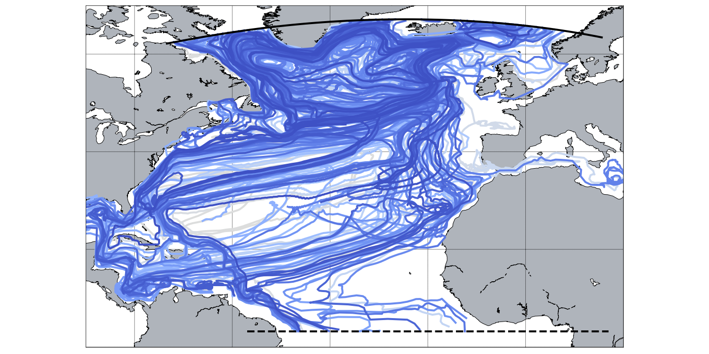

TRACMASS features: initialisation  with **tracermin0** and **tracermax0**
^^^^^^^^^^^^^^^^^^^^^^^^^^^^^^^^^^^^^^^^^^^^^^^^^^^^^^^^^^^^^^^^^^^^^^^^^

Trajectories can be initialised using a tracer value criteria by defining the minimum (**tracermin0**) and the maximum (**tracermax0**) value of the tracers. In this example, only waters with temperatures between :math:`2-4^\circ C` and salinity between 34.9-35.0 PSU are selected (red trajectories). This reduces the number of trajectories that are started compared to the default case (blue trajectories). This is seen better on a T-S diagram.

.. image:: figs/fig_orca1_2.png
    :width: 100%
    :align: center
    :alt: An example of tracermin0 and tracermax0.

TRACMASS features: killing zones II (**exitType=2** and **exitType=3**)
^^^^^^^^^^^^^^^^^^^^^^^^^^^^^^^^^^^^^^^^^^^^^^^^^^^^^^^^^^^^^^^^^^^^^^^

Trajectories can be terminated using different conditions set by **exitType**. By setting **exitType** to one, trajectories are terminated based on a geographical condition (solid and dashed black lines). By setting **exitType** to two, a value of tracer is used to terminate trajectories. This is harder to see in the geographical projection of trajectories, but it is easily seen in the tracer space. In the example below we impose a killing zone along the :math:`15^\circ C` isotherm (red trajectories). **exitType=3** is a combination of both trajectory and tracer conditions (green trajectories).

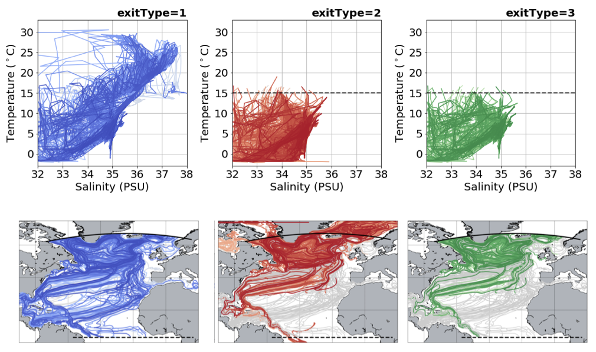

TRACMASS features: stream functions II (**psiyz** - meridional)
^^^^^^^^^^^^^^^^^^^^^^^^^^^^^^^^^^^^^^^^^^^^^^^^^^^^^^^^^^^^^^^

If stream function calculation (**l_psi**) is activated, a stream function will be calculated to each of the killing zones. This way one is able to separate the total Lagrangian meridional stream function into the different components depending of the killing zone. All the stream functions showed in the figure below are computed offline and with **dirpsi** equal to minus one. Trajectories are starting both in the northern and southern boundary.

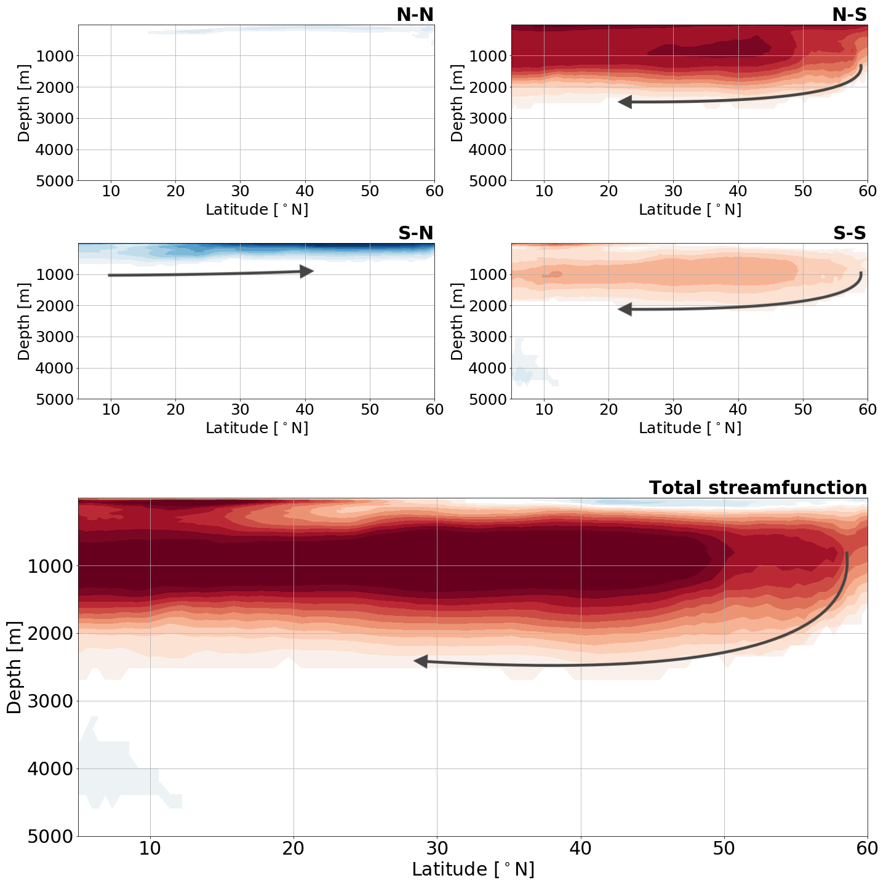

.. important:: The Lagrangian stream function may differ from the Eulerian stream function if the number of trajectories is not large enough.

TRACMASS features: use of subdomains (**l_subdom**)
^^^^^^^^^^^^^^^^^^^^^^^^^^^^^^^^^^^^^^^^^^^^^^^^^^^
Activating a subdomain (**l_subdom**) is useful especially for high resolution data and when there is no need to read the whole domain. The figure below shows an example of the use of a subdomain. The default case describes a group of trajectories that starts at the surface in the area near cape Aghulas. A geographical condition is imposed to terminate the trajectories (solid blue line). The dashed black line represents the limit the original domain (the setup includes zonal cyclic boundaries **iperio=1**). The centre panel represents a regular box (**imindom<imaxdom**) and the right one a split box (**imaxdom<imindom**). The subdomain is represented by the red solid line while the new killing zones are represented by the red dashed lines.

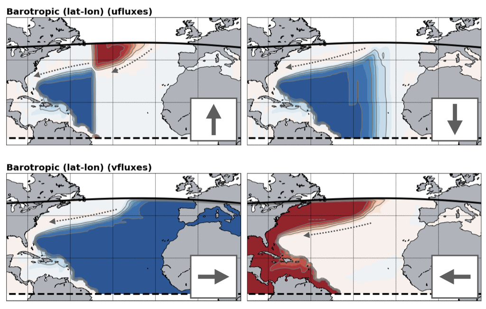

IFS (3D dataset)
----------------

The IFS data is stored on a Arakawa's A-grid while TRACMASS is defined on a Arakawa's C-grid. Therefore, both zonal and meridional fluxes are computed interpolating the velocity fields on the TRACMASS grid. This is done on the **read_field** subroutine. The default setup of this project initialises trajectories in an area that covers south Asia. The seeding takes place every six hours during a month.

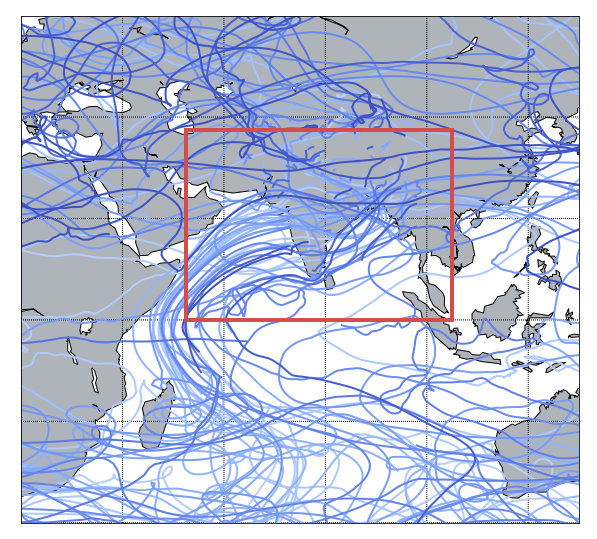

TRACMASS features: seeding trajectories using a mask (**maskFile**)
^^^^^^^^^^^^^^^^^^^^^^^^^^^^^^^^^^^^^^^^^^^^^^^^^^^^^^^^^^^^^^^^^^^
The seeding can be restricted using a mask file. The **maskFile** is only read if **seedType=1**, The seeding domain is described by the red rectangle in both figures below. If no mask is applied all grid points in the defined area can initialise a trajectory. The blue dots represent grid cells where trajectories are seeded. The figure on the right shows if a mask is applied to the seeding. The mask is given by the gray filled contour and the seeded trajectories are given in orange. As expected only trajectories that are within the mask and the seeding domain are initialised (note that the mask in this case is also defined outside the seeding domain).

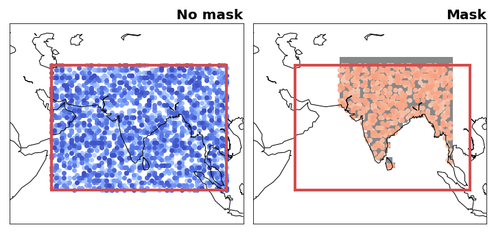

TRACMASS features: flux & tracer trajectories (**l_swtraj**)
^^^^^^^^^^^^^^^^^^^^^^^^^^^^^^^^^^^^^^^^^^^^^^^^^^^^^^^^^^^^^^^^^^^
TRACMASS allows to compute a special case of trajectories that combine tracers and mass/volume fluxes. This option is useful to follow water trajectories in the atmosphere, or salt in the ocean. If **l_swtraj** TRUE, the mass/volume fluxes are multiplied by the tracer chosen in the first position. The figure below shows trajectory densities computed using the default setup of the project and a seeding mask. The figure on the left shows the trajectory density for the default case (air trajectories) while the figure on the right shows trajectories computed by multiplying the fluxes by humidity (water trajectories).

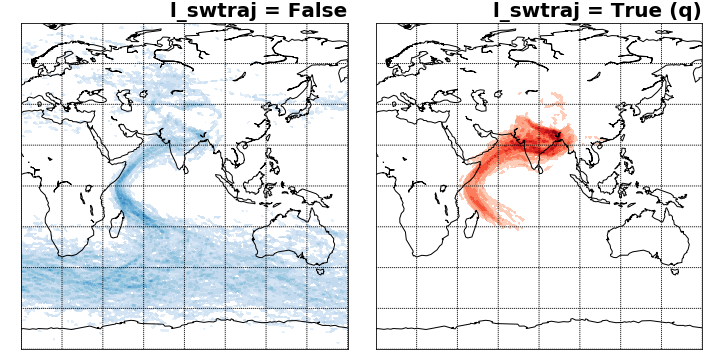

ROMS (3D dataset)
-----------------

The ROMS data is defined on the same grid as the  TRACMASS grid. Therefore, there is no need to interpolate velocities or tracer on the TRACMASS grid. However, ghosts u and v points are defined around the frame to adjust to the TRACMASS grid. The default setup of this project initialises trajectories west of Sri Lanka only for northward fluxes (solid blue line). The seeding takes place every month (12 seeding steps) and one trajectory is initialised in the location. Trajectories are terminated when exiting the ROMS domain, the maximum time for trajectories is 100 years.

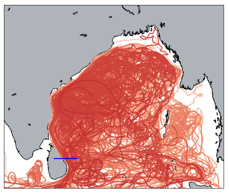

TRACMASS features: online/offline calculation of stream functions (**l_offline**)
^^^^^^^^^^^^^^^^^^^^^^^^^^^^^^^^^^^^^^^^^^^^^^^^^^^^^^^^^^^^^^^^^^^^^^^^^^^^^^^^^

Stream functions can be calculated in two ways in TRACMASS either online (**l_offline=FALSE**), while trajectories are computed, or offline (**l_offline=TRUE**) as a part of the postprocessing of the results. The online case is the same regardless of the choice of **write_frec**. However, for the offline case the choice of **write_frec** is relevant. For low writing frequencies **write_frec=1** and **write_frec=2** the online calculation is less accurate. The figure below shows an example of different calculations of the barotropic stream function for different writing frequencies.

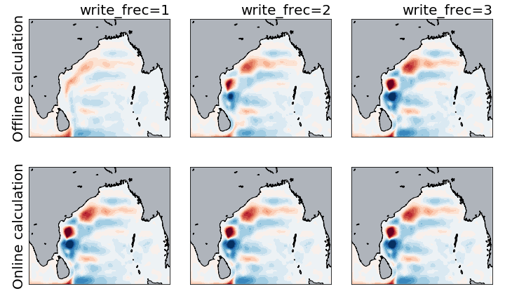

.. warning:: Offline calculation of stream functions may give a wrong result for **write_frec=1** and **write_frec=2**. For an accurate calculation of stream functions use **write_frec=3** or **write_frec=4** or an online calculation.
