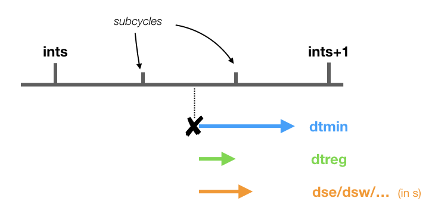
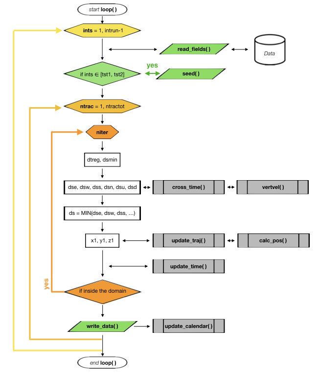
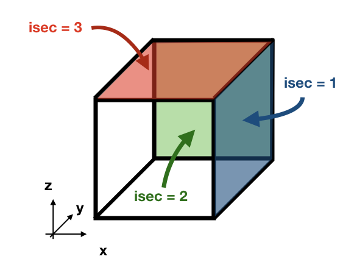
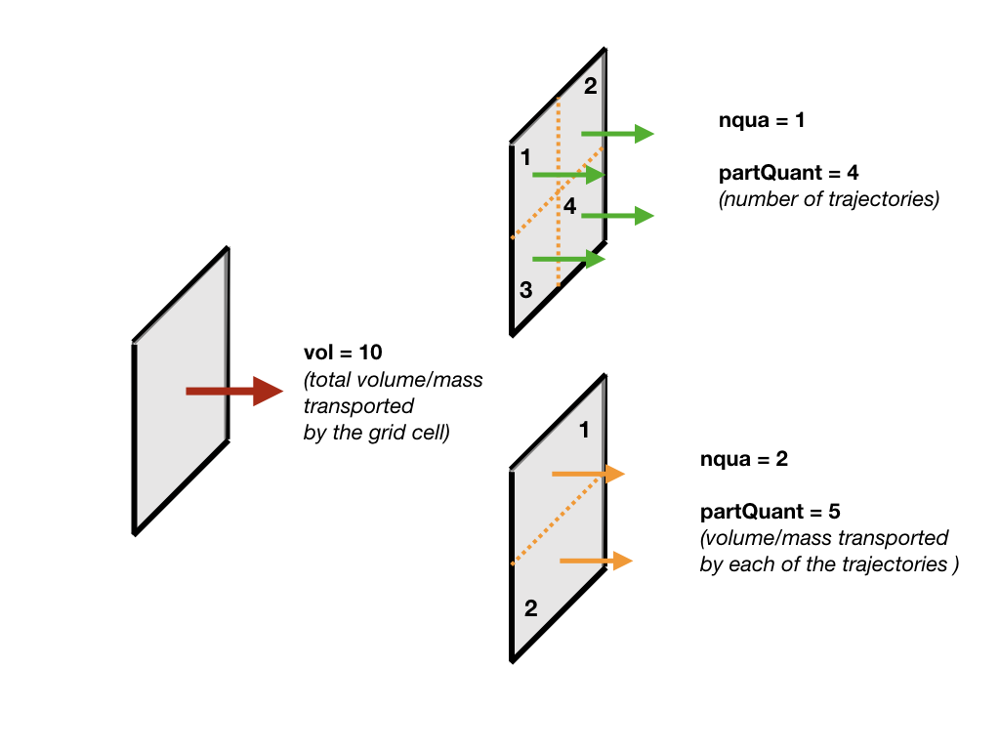
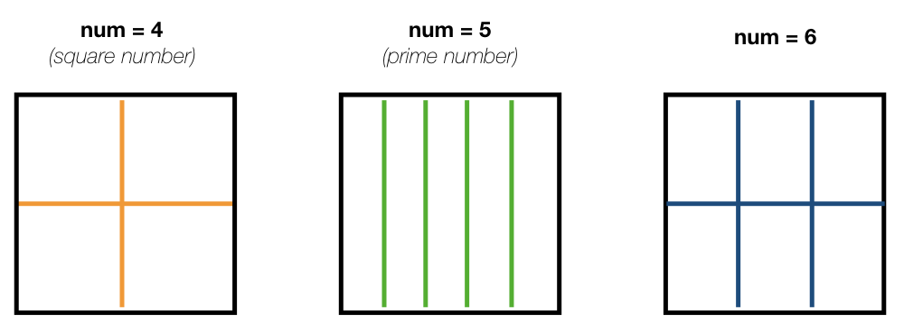
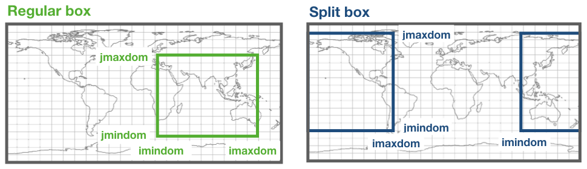
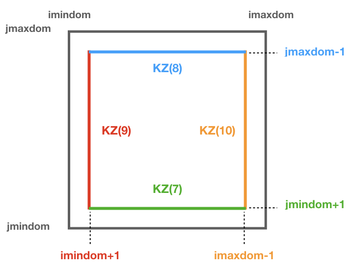
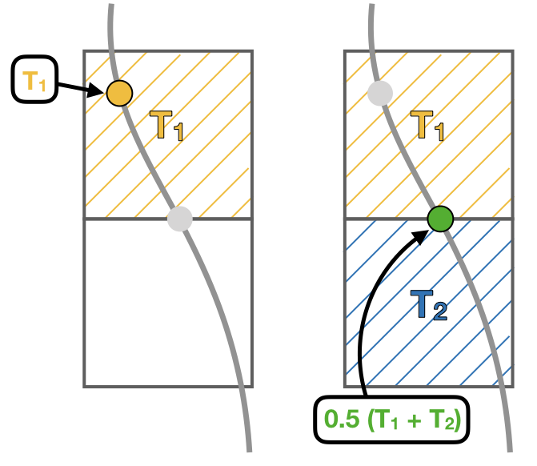
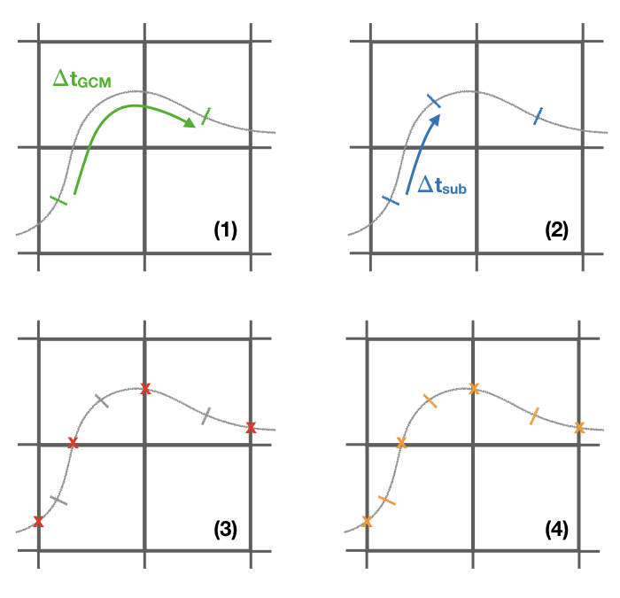

Main modules
============
.. _md_program:

mod_calendar.F90
----------------

The module **mod_calendar** contains all the subroutines that initialise and update the calendar of the simulation. This module contains five subroutines: **init_calendar**, **previous_calendar**, **update_calendar**, **end_calendar** and **tt_calendar**.

* The subroutine **init_calendar** defines the starting date of the calendar as well as the time step of the simulation **tseas**.

* **update_calendar** updated the calendar using the given time step and the initial date. The calendar is computed for both forward and backward simulations in time. Let us consider a simulation forward in time, where the start year (**StartYear**) is set to 2000 and the current year (**currYear**) is 2004. The variable **iyear** describes the number of simulation years. If **loopYears** is activated, after reaching the year set as **loopEndYear** (2010 in this case) the calendar is set back to the **loopStartYear** (2000). **iyear** is not altered by this correction.

  .. image:: figs/fig_calendar.png
    :width: 700px
    :align: center
    :height: 600px
    :alt: Example of a forward and backward calendar

  .. warning::  Note than in backward simulations in time, **loopStartYear>loopEndYear**. The start year (**StartYear**) is always larger or equal to the current year (**currYear**) - unless **loopYears** is activated.  If **loopYears** is activated, the calendar is corrected in similar way to the forward simulations (see Figure above).

* **end_calendar** computes the final date of simulation defined by the time step **intrun**, while **previous_calendar** computes the date previous to the starting date. The latter is required when **loopYears** is activated.

* **tt_calendar** uses the starting date as a reference and translates the time step **tt** into a date (year, month, day) and time (hour, minute, second).

This module contains four subroutines:

.. f:autosubroutine:: init_calendar

.. f:autosubroutine:: update_calendar

.. f:autosubroutine:: end_calendar

.. f:autosubroutine:: previous_calendar

.. f:autofunction:: tt_calendar

mod_clock.F90
-------------

The module **mod_clock** calculates the new time step referenced to the initial time step. This module contains one subroutine **update_time**.

The subroutine updates **tt** and **ts** based on the value of **ds**. This is transform to a time step in seconds **dt** by multiplying **ds** with the volume **dxyz**. The subroutine chooses between the smallest of three different time steps:

1 - **dtmin** which is the time step between two time subcycles :math:`t_{min} = \frac{\Delta t}{iter}` where **iter** is the number of subcycles.

2 - **dtreg** which is the time step to the next time subcycle.

3 - And the time step corresponding to the smallest wall crossing time computed with **cross_time**.

After updating the values of **tt** and **ts**, the new values of **intrpb** and **intrpr** are computed.

.. f:autosubroutine:: update_time

mod_error.F90
-------------

The module **mod_error** check for possible errors in the simulation. If any error is found a diagnostic file with a summary of the error is created. This module contains two subroutines and two private function: **errorCheck**, **write_error**, **errorType**, and **reverse**.

* **errorCheck** check for a possible error defined by **teststr**. The possible errors are listed below:

    +-------------------+---------------+--------------------------------------------------------+
    | **teststr**       |  **errCode**  |  Description                                           |
    +===================+===============+========================================================+
    |  *infLoopError*   |        1      |  Trajectory trapped in an **infinite loop**            |
    +-------------------+---------------+--------------------------------------------------------+
    |  *dxyzError*      |        2      |  The volume of the gridbox is **zero** or **negative** |
    +-------------------+---------------+--------------------------------------------------------+
    |  *boundError*     |        3      |  Trajectory leaving the **domain**                     |
    +-------------------+---------------+--------------------------------------------------------+
    |  *landError*      |        4      |  Trajectory hits a **land** point                      |
    +-------------------+---------------+--------------------------------------------------------+
    |  *coordboxError*  |      5/6/7    |  Trajectory placed in the **wrong** box                |
    +-------------------+---------------+--------------------------------------------------------+
    |  *dsCrossError*   |        8      |  No **available pathways** for the trajectory          |
    +-------------------+---------------+--------------------------------------------------------+

    .. note: A **infinite loop** is defined when a trajectory is iterated more than 30000 times since last time it crossed a wall or started a time subcycle.

* If an error is found in a trajectory, the last position and time step will be stored in a *_err.csv* file. The module **write_error** besides writing the number of the trajectory **ntrac**, the last position **x1, y1, z1**, the volume/mass transport **subvol** and the time step; it also gives a short description of the error.

.. note :: The positions are given referenced to the original dataset reference system.

* **errorType** is a private function that gives a short description of the error given by **errorCode**. This output is used by **write_error**.

* **reverse** updates the indexes if the original data's grid does not correspond to the TRACMASS grid set up.

This module contains two subroutines:

.. f:autosubroutine:: errorCheck

.. f:autosubroutine:: write_error

and a private function:

.. f:autosubroutine:: errorType

mod_getfile.F90
---------------

The module **mod_getfile** consists on three functions: **filledFileName** which updates the dateprefix according to the calendar, **get2DfieldNC** to extract 2D data fields, and **get3DfieldNC** to extract 3D data fields.

* The function **filledFileName** has four arguments: *filedPattern* a character string that contains the dateprefix, and *inyear*, *inmon* and *inday* representing the year, month and day of the calendar. The function will find the string YYYYMMDD and replace it with the corresponding year, month or/and day.

* The function **get2DfieldNC** has five arguments: *fieldFile* the path to the netCDF file, *varName* name of the variable to be extracted, *start2D* a 4D array that describes the starting indexes, *count2D* a 4D array that describes how many indexes are read, and *cextend* an optional argument to read 2D fields in v points (an extra j index).

* The function **get3DfieldNC** has six arguments: *fieldFile* the path to the netCDF file, *varName* name of the variable to be extracted, *start3D* a 4D array that describes the starting indexes, *count3D* a 4D array that describes how many indexes are read, *stcase* describes the order data is stored in the netCDF file:

    - *'ts'*:  [time, x, y, z]
    - *'st'*:  [x, y, z, time]
    - *'ts_r'*: [time, z, y, x]
    - *'st_r'*: [z, y, x, time]

  and *cextend* an optional argument to read 3D fields in v points (an extra j index).

.. note ::

  If the original data is reduced to a subdomain, both functions will only extract data in the selected subdomain. For the case where the subdomain crosses the zonal limit of the original domain, the function will read separately the two subdomains and then join them into a unique subdomain (blue domain).

  .. image:: figs/fig_netcdf.png
      :width: 500px
      :align: center
      :height: 400px
      :alt: Description of mod_pos

This module contains three functions:

.. f:autosubroutine:: filledFileName

.. f:autosubroutine:: get2DfieldNC

.. f:autosubroutine:: get3DfieldNC

mod_init.F90
------------

The module **mod_init** consists of two subroutines: **init_namelist** that reads the namelist, and **init_alloc** that allocates all the allocatable arrays. More information about the namelist can be found in the *Namelist* chapter.

It contains an internal subroutine **reverse** to adapt the meridional indexes to the TRACMASS reference system.

.. f:autosubroutine:: init_namelist

.. f:autosubroutine:: init_alloc

mod_loop.F90
------------

The module **mod_loop** is the core module of TRACMASS. This module contains the big loop that updates the calendar, the clock and the position of the trajectories.

This is how the module works:

1 - First the fields are updated according to the value of **ints**.

2 - Then, if the time step corresponds to a seeding time, the subrotuine **seed** is called.

3 - Then the loop checks all the possible trajectories given by **ntrac**. If the trajectory is not activated the module while skip it.

4 - If a trajectory is activated it will be iterated several times where its position will be updated (**update_traj**).

5 - If the trajectory exceedes the limit time **timax**, it will be deactivated.

6 - After each iteration the calendar is updated.

.. note:: If all the trajectories are deactivated the simulation will be stopped even if the corresponding time step is not the final one set by **intrun**.

This module contains a single subroutine:

.. f:autosubroutine:: loop

mod_pos.F90
-----------

The module **mod_pos** calculates the new position of a trajectory and the time it will take to cross a wall in the gridbox. This module contains three subroutines: **cross_time**, **calc_pos**, and **update_traj**.

* The subroutine **cross_time** computes the time it will take to cross any of the faces determined by the variable **ijk**. The possible values of **ijk** are (1) for the east/west faces, (2) for the north/south faces, and (3) for the up/down faces. For simplicity, let us consider the case of **ijk** =1 with an eastward zonal flow **uflux**.

  .. image:: figs/fig_boxpos.png
      :width: 300px
      :align: center
      :height: 300px
      :alt: Description of mod_pos

  This is how the module works:

  1 - First, the interpolated values of the zonal flow **uflux** in the east wall (**uu**) and in the west wall (**um**) are computed. A linear interpolation is used to obtained the values for **uu** and **um**:

  .. math::

     U_i(t) = \frac{(t-t_0) \ U_i(t_1) + (t_1-t) \ U_i(t_0)}{t_1-t_0} \quad \text{where} \quad t_0 \le t \le t_1.

  In this case :math:`t_0` and :math:`t_1` represent the *n* and *n+1* time step.

  2 - If **uu** is positive the subroutine computes the crossing time through the eastern wall :math:`t_E` (**sp**).

  2.1 - If  **uu** = **um**, the time it will take to the trajectory to cross the east wall is:

  .. math::

     t_{E} = \frac{x_E-x}{U_i(t)}.

  2.2 - If **uu** :math:`\neq` **um**, the velocity field inside the box is linearly interpolated:

  .. math::

     U(x) = (x-x_W)(U(x_E)-U(x_W)) + U(x_W) \quad \text{where} \quad x_W \le x \le x_E,

  where **iam** represents the index for the western wall (:math:`x_W`) and **ia** represents the eastern wall (:math:`x_E`). If :math:`U(x)>0` at the starting position of the particle, the time to reach the eastern wall is given by:

  .. math::

     t_{E} = \frac{1}{U(x_W)-U(x_E)}\log\left(\frac{U(x)}{U_E} \right).

  2.3 - If none of the above conditions is fulfilled the subroutine returns the value **UNDEF** for **sp**.

  3 - Following a similar procedure, the subroutine computes the crossing time through the western wall (**sn**).

.. note:: The equations used to compute the crossing time considers a different spatial interpolation of :math:`U(x)` for **sn**. The crossing time through the western wall is given by the following equation :math:`t_{W} = \frac{1}{U(x_W)-U(x_E)}\log\left(\frac{U(x)}{U_W} \right)`.

* The subroutine **calc_pos** computes the new position of the trajectory after time **ds** in the direction given by **ijk**. This subroutine works in the following way (let us consider the same case as in the previous example for **cross_time**):

  1 - First, the interpolated values of the zonal flow **uflux** in the east wall (**uu**) and in the west wall (**um**) are computed. A linear interpolation is used to obtained the values for **uu** and **um**.

  2.1 - If  **uu** = **um**, the new position of the trajectory is given by:

  .. math::

     x_1 = x_0 + U(x_E)ds

  2.2 - On the other hand, if **uu** :math:`\neq` **um** the new position is:

  .. math::
     x_1 = \left(x_0 - x_W + \frac{U(x_W)}{U(x_E)-U(x_W)} \right) \exp((U(x_E)-U(x_W))ds) + x_W - \frac{U(x_W)}{U(x_E)-U(x_W)}.

.. warning:: If the trajectory is placed at :math:`U(x)=0` in a divergent field, **calc_pos** is not able to determine the new position (unstable equilibrium).

* The subroutine **update_traj** updates the position of the trajectory after a time step given by **ds** and computes the new values for **x1**, **y1**, and **z1**. The subroutines check if any of the crossing values given by **cross_time** corresponds to the value of **ds** to determine the new position.

                        +---------+----------+---------+--------+----------------+
                        | **ds**  |  **ib**  | **jb**  | **kb** | Crossing wall  |
                        +=========+==========+=========+========+================+
                        |   dse   |  ia + 1  |         |        | Eastern wall   |
                        +---------+----------+---------+--------+----------------+
                        |   dsw   |  ia - 1  |         |        | Western wall   |
                        +---------+----------+---------+--------+----------------+
                        |   dsn   |          |  ja + 1 |        | Northern wall  |
                        +---------+----------+---------+--------+----------------+
                        |   dss   |          |  ja - 1 |        | Northern wall  |
                        +---------+----------+---------+--------+----------------+
                        |   dsu   |          |         | ka + 1 | Upper wall     |
                        +---------+----------+---------+--------+----------------+
                        |   dsd   |          |         | ka - 1 | Lower wall     |
                        +---------+----------+---------+--------+----------------+

If **ds** is smaller than any of the crossing times and equal to the time stepping, or if the trajectory is inside a convergence zone where all the crossing times are **UNDEF**. The trajectory remains inside the box.

.. note :: If stream functions are computed online (*l_offline* is false), this subroutine will transfer the required information to compute geographical streamfunctions.

.. important :: The north fold (**jperio**) is an important feature for original grids that are not based on latitude longitude such as the ORCA grids. The current version includes two possible corrections to the north fold: no correction (0), and  correction for ORCA grids (1).

This module contains three subroutines:

.. f:autosubroutine:: cross_time

.. f:autosubroutine:: calc_pos

.. f:autosubroutine:: update_traj

mod_postprocess.F90
-------------------

The module **mod_postprocess** reads the output files, computes offline streamfunctions and a more detailed summary of the TRACMASS run.

* The subroutine **postprocessing** reads the output files and stores the require information to compute a summary or offline streamfunctions. The following information is read: the initial number of trajectories and total transport (from *_ini.csv*), the number of trajectories that left the domain or exceeded the time limit and the total tranport (from *_out.csv*), and the position indexes and the tracer values (from *_run.csv* if offline streamfunctions are computed).

* **init_alloc_stream** allocates and initialises the required arrays to compute offline streamfunctions.

* **print_summary** prints a short summary of the total number of trajectories that are initialised and the ones that left the domain (organised by the different killing zones). It also prints a summary of the transports. This subroutine is only called if the main program is run with the *summary* argument on (see chapters *Configuration* and *Main program*).

This module contains three subroutines:

.. f:autosubroutine:: postprocessing

.. f:autosubroutine:: init_alloc_stream

.. f:autosubroutine:: print_summary

mod_print.F90
-------------

The module **mod_print** is responsible for printing the basic information about the run which includes a short summary of the model configuration, the number of trajectories run and a final summary of the number trajectories that are still running, have been deactivated or have errors.

This module includes five subroutines:

.. f:autosubroutine:: print_header_main

.. f:autosubroutine:: print_header_postprocess

.. f:autosubroutine:: writesetup_main

.. f:autosubroutine:: print_start_loop

.. f:autosubroutine:: print_cycle_loop

.. f:autosubroutine:: print_end_loop

.. f:autosubroutine:: print_end_main

mod_seed.F90
------------

The module **mod_seed** defines all the variables and arrays neccesary for the seeding of particles. This modules contains two public subroutines (**init_seed** and **seed**) and two private subroutines (**split_grid** and **reverse**)

The subroutine **init_seed** defines the grid points and the time steps where the particles are going to be initialised, the wall of the grid where they are going to be placed (**isec**), and their direction (**idir**). There are three options for **isec**: (1) on the east wall of the grid cell, (2) on the north wall of the grid cell, and (3) on the top wall of the grid cell. idir selects the initial direction of the trajectories eastward/northward/upward (**idir = 1**) or westward/southward/downward (**idir = -1**).

.. note:: If the simulation is backward in time (**nff = -1**), idir represents the last direction of the trajectory to follow. For example, let us consider a eastward flow field. A simulation with **nff = -1** and **idir = 1** will follow trajectories back in time that initially are moving eastward.

The initial seeding location, time, and direction can be defined directly in the namelist or read from a file. This is control by **seedType** and **seedTime**.

* **seedType**: (1) the seeding location is defined by the grid points within the volume described by **(ist2-ist1+1)x(jst2-jst1+1)x(kst2-kst1+1)**, all these trajectories will shared the **idir** and **isec** defined in the namelist, or (2) the seeding location and the direction is read from an external file **seedDir/seedfile**.

* **seedTime**: (1) the seeding happens in the time interval defined between **tst2** and **tst1**, or (2) it is read from a external file **seedDir/timeFile**.

The **seed** subroutine populates the **trajectory** array that contains the position of the trajectories as well as their corresponding volume/mass transport. This module works this way:

1 - The subroutine checks if the current time **ntime** corresponds to a seeding time.

2 - The corresponding flux is chosen according to the value of **isec**. If the direction does not correspond to the value of **idir** the trajectory is not activated.

3 - **num**, the number of trajectories per grid point, is defined. There are different options based on **nqua**: (1) the number of trajectories is defined by **partQuant**, or (2) the particles transport a specific volume/mass transport defined by **partQuant**, the number of particles in the grid is then defined dividing the total volume/mass transport by **partQuant**.

4 - The grid is split in equal parts using the private subroutine **split_grid**. If **num** is a square number the grid cell is divided in equal squares, if **num** is a prime number the grid is split in equal rectangles along one axis (see figure below). For other cases, **split_grid** will divide the square in equal rectangles with similar side lengths.

5 - The specific volume/mass transport of a trajectory **subvol** is computed from **num**.

6 - The trajectories are placed in the middle of each of the rectangles. This initial position is given by **x1, y1, z1**.

.. warning:: **x1, y1, z1** are computed using the gridbox as a reference.

7 - If TRACMASS is rerun or run to compute streamfunctions, only the trajectories that exit through a kill zone will be activated.
Besides, if **l_tracers** is true, the trajectories outside the tracer limits **tracer0min** and **tracer0max** will be deactivated.

8 - The position of the trajectory in the gridbox reference system, the trajectory number **ntrac**, the corresponding position index and the mass/volume transported by it is stored in the array **trajectories**.

The private subroutine **reverse** adjust the seeding indexes to the TRACMASS reference system.

This module contains two public subroutines:

.. f:autosubroutine:: init_seed

.. f:autosubroutine:: seed

and two private subroutine:

.. f:autosubroutine:: split_grid

.. f:autosubroutine:: reverse

mod_stream.F90
--------------

The module **mod_stream.F90** is responsible for computing volume/mass fluxes and compute different stream functions. This module contains four subroutines **compute_stream**, **init_stream**, **update_fluxes** (online computation of streamfunctions) and **compute_stream** (offline computation of streamfunctions).

* The subroutine **init_stream** initialises and allocates all the fluxes (*fluxes_*) and streamfunction (*psi_*) arrays.

.. table::
  :align: center

  +----------------------+---------------------------+----------------------------------+
  | *Flux type*          |   **l_offline** = TRUE    |      **l_offline** = FALSE       |
  +----------------------+---------------------------+----------------------------------+
  | Barotropic (x-y)     |    (imt, jmt, 10)         |    (imt, jmt, ntractot)          |
  +----------------------+---------------------------+----------------------------------+
  | Meridional (y-z)     |    (jmt,  km, 10)         |    (jmt,  km, ntractot)          |
  +----------------------+---------------------------+----------------------------------+
  | Latitude-tracer (y-r)| (jmt, mr, 10, numtracers) | (jmt, mr, ntractot, numtracers)  |
  +----------------------+---------------------------+----------------------------------+
  | Tracer-tracer (r-r)  | ( mr, mr, 10, numtracers) | ( mr, mr, ntractot, numtracers)  |
  +----------------------+---------------------------+----------------------------------+

.. note::
  *mr* is the tracer space resolution (501 by default) and *numtracers* is the number of tracers.

* If streamfunctions are computed online (*l_offline* is false), the subrotuine **update_fluxes** is responsible to update the fluxes and filter them according to the trajectory number. This subroutine has six arguments: *index1, index2* represent the indexes of the two coordinates of the streamfunction, *dir* is the direction of the trajectory (in the streamfunction coordinate reference system), *psicase* indicates the type of streamfunction that is computed (*'xy'*: barotropic, *'yz'*: meridional streamfunction, *'yr'*: latitude-tracer streamfunction, and *'rr'*: tracer-tracer streamfunction). The fifth argument is optional (*indt1*) and it is used whenever a *'yr'* streamfunction is used to represent the different tracer choice.
.. math::

    F(\textbf{index1,index2}[, \textbf{indt1}]) = F(\textbf{index1,index2}[, \textbf{indt1}]) + dir \cdot \textbf{subvol}
|

    If *psicase* is *'rr'*, *index1, index2* are linked to the present and past time step of the first tracer, and *indt1, indt2* are the present and past time step of the second tracer. The computation of the fluxes in this case is more generalised:

.. math::

    F(\textbf{indm1,indm2}) = \textbf{subvol}
|

    where :math:`\textbf{indm1}=[index1,index2)` and :math:`\textbf{indm2}=indt1 + slope \cdot(\textbf{indm1}-index1)`. The slope is given by :math:`(indt2-indt1)/(index2-index1)`.

    .. image:: figs/fig_fluxes.png
      :width: 350px
      :align: center
      :height: 250px
      :alt: Description of fluxes

* If streamfunctions are computed offline (*l_offline* is true), the subrotuine **compute_fluxes** is responsible to update the fluxes and filter them according to the killing zones. If *write_frec* is 3 (stored everytime it crosses a wall) or 4 (save everytime), the fluxes are computed when the stored index corresponds to a zonal wall (barotropic) or to a meridional wall (meridional or latitude-tracer). The tracer-tracer fluxes are computed as in the online case. For other *write_frec* all the fluxes are computed using the method to compute the tracer-tracer fluxes (see the online case).

* The subroutine **compute_stream** integrates the fluxes computed by **update_fluxes** or **compute_fluxes** to compute the stream functions. In the case of online calculation of stream function, the subroutine filters only the *ntracs* that exited through the killing zones. The integration direction is defined by **dirpsi**.

  .. math::
    \Psi(\textbf{index1,index2}[, \textbf{indt}]) &=& \sum^{\text{\textbf{index2}}}_{index=0} -F(\textbf{index1},index[, \textbf{indt}]) \quad \text{(dirpsi = 1)} \\

    \Psi(\textbf{index1,index2}[, \textbf{indt}]) &=& \sum_{index=\text{\textbf{index2}}} F(\textbf{index1},index[, \textbf{indt}])  \quad \text{(dirpsi = -1)}.
|

  .. note:: This is an example of how a stream function is computed. Consider two trajectories (A) with the same volume/mass transport. The computed fluxes are shown in (B) where blue represents positive fluxes and orange negative fluxes. Notice that the region where both trajectories cross the same wall the resulting flux is zero as they cancel each other. The resulting stream function (C) is computed integrating in a downward direction.

    .. image:: figs/fig_stream.png
      :width: 600px
      :align: center
      :height: 200px
      :alt: Description of streamfunctions

This module contains four public subroutines:

.. f:autosubroutine:: update_fluxes

.. f:autosubroutine:: compute_fluxes

.. f:autosubroutine:: init_stream

.. f:autosubroutine:: compute_stream

mod_subdomain.F90
-----------------

The module **mod_subdomain.F90** is responsible to define a subdomain and updating the indexes according to the new domain. Defining a subdomain is useful to run TRACMASS with high resolution data especially if the area of study does not cover the whole original domain. Two types of subdomain can be declared: a regular box (**imindom** < **imaxdom**) and a split box (**imaxdom** < **imindom**).

.. note :: The subdomain is only defined in the longitude-latitude space.

It consists of two subroutines **init_subdomain** and **update_subindex**:

* The subroutine **init_subdomain** defines the size of the new subdomain. If a subdomain is chosen (**l_subdomain** is true) the new size of the domain is defined as:

.. table::
  :align: center

  +-------------------+-------------------------------------------+--------------------------------+
  | *Subdomain type*  |*zonal dimension* (**imt**)                |*meridional dimension* (**jmt**)|
  +-------------------+-------------------------------------------+--------------------------------+
  |Regular box        |**imaxdom** - **imindom** + 1              |**jmaxdom** - **jmindom** + 1   |
  +-------------------+-------------------------------------------+--------------------------------+
  |Split box          |**imtdom** + **imaxdom**  - **imindom** + 1|**jmaxdom** - **jmindom** + 1   |
  +-------------------+-------------------------------------------+--------------------------------+

..

  Besides, once the subdomain is declared a kill zone is imposed around the boundaries of the subdomain. To avoid problems with the possible kill zones defined by the user in **kill_zones.F90** the subdomain kill zones are declared for the indexes 7,8,9 and 10.

* The subroutine **update_subindex** updates the subindexes before trajectories are seeded. The indexes are updated using **imindom** and **jmindom** as referenced. There is an special case for the *Split box* case.

.. table::
  :align: center

  +-------------------+-------------------------------------------------------+---------------------------+
  | *Subdomain type*  |*zonal index* (**ji**)                                 |*meridional index* (**jj**)|
  +-------------------+-------------------------------------------------------+---------------------------+
  |Regular box        |**ji** - **imindom** + 1                               |**jj** - **jmindom** + 1   |
  +-------------------+-------------------------------------------------------+---------------------------+
  |Split box          |**ji** - **imindom** + 1    (if **imindom** <= **ji** )|**jj** - **jmindom** + 1   |
  +                   +-------------------------------------------------------+                           +
  |                   |**ji** - **imtdom** - **imindom** + 1  (otherwise)     |                           |
  +-------------------+-------------------------------------------------------+---------------------------+

This module contains two subroutines:

.. f:autosubroutine:: init_subdomain

.. f:autosubroutine:: update_subindex

mod_tracers.F90
---------------

If TRACMASS is run with tracers (**l_tracers** is true), the module **mod_tracers.F90** contains all the subroutines needed to initialise, allocate, compute and update tracers.

* **init_tracer** initialise the **tracers** array from the information provided in the namelist. This information consists of a short description of the tracer (**name**), **units**, whether the tracer is read from an input file ( **action** =='read') or computed in TRACMASS ( **action** ='compute'). If the tracer is read, the name of the variable in the input file is given by **varname** and the number of **dimension**-s.

.. important :: To compute stream functions it is important to define the lower (**minimum**) and the upper (**maximum**) limit of the tracer coordinate.

* If **action** is compute, the subroutine **compute_tracer** will calculate the tracer from other tracers read from input files.

+---------------+-----------------+--------------------+----------------+----------------+
| *tracername*  | Description     | External function  |   Argument 1   |   Argument 2   |
+---------------+-----------------+--------------------+----------------+----------------+
| sigma0        | sigma-0 density | **thermo_dens0**   |   Temperature  |   Salinity     |
+---------------+-----------------+--------------------+----------------+----------------+

* **update_tracers** updates the value of the tracer in the new position (computed by **update_traj**). The tracers are updated using the nearest point approach where trajectory stores the value of the tracer in the nearest T point. If the trajectory crosses a grid wall the tracer value is the mean value between the two nearest T points. A time interpolation is computed before the spatial interpolation.

* The private subroutine **tracers_default** assigns default values to the **tracers** array for the most common tracers. The tracers included in this subroutine are:

.. table::
  :align: center

  +----------+--------+-----------+-----------+----------+-----------+---------------------------+
  | **name** |**unit**|**minimum**|**maximum**|**action**|**varname**| Descripition              |
  +----------+--------+-----------+-----------+----------+-----------+---------------------------+
  | To       | degC   |  -3       | 33        | read     | T         | Temperature (Ocean)       |
  +----------+--------+-----------+-----------+----------+-----------+---------------------------+
  | Ta       | K      |  173      | 223       | read     | T         | Temperature (Atmosphere)  |
  +----------+--------+-----------+-----------+----------+-----------+---------------------------+
  | Tp       | K      |  173      | 223       | read     | Tp        | Potential temperature     |
  +----------+--------+-----------+-----------+----------+-----------+---------------------------+
  | S        | g kg-1 |  32       | 38        | read     | S         | Salinity                  |
  +----------+--------+-----------+-----------+----------+-----------+---------------------------+
  | q        | g kg-1 |  0        | 25        | read     | q         | Specific humidity         |
  +----------+--------+-----------+-----------+----------+-----------+---------------------------+
  | sigma0   | kg m-3 |  19       | 29        | compute  |           | Sea water density (sigma0)|
  +----------+--------+-----------+-----------+----------+-----------+---------------------------+
  | p        | hPa    |  0        | 1100      | compute  |           | Atmospheric pressure      |
  +----------+--------+-----------+-----------+----------+-----------+---------------------------+

* The function **tracerbin** translates the tracervalue to an index in the tracer space,

.. math::
  tracerbin = \frac{tracervalue - min(tracervalue)}{\Delta tracervalue}

This module contains two public subroutines and a private subroutine:

.. f:autosubroutine:: init_tracer

.. f:autosubroutine:: compute_tracer

.. f:autosubroutine:: update_tracer

.. f:autosubroutine:: tracers_default

.. f:autosubroutine:: tracerbin

mod_vars.F90
------------

**mod_vars.F90** is a collection of different modules that define the required variables for the different components of TRACMASS. This file contains 10 modules:

- **mod_precdef**: defines the precisions of the REAL variables.

- **mod_log**: defines the verbose variables.

- **mod_param**: the general parameters of TRACMASS are defined here.

- **mod_seedvars**: the variables used in **mod_seed** are defined here.

- **mod_trajdef**: the derived TYPE **trajectory** is defined in this module.

- **mod_loopvars**: the variables used in **mod_loop** are defined here.

- **mod_traj**: the variables to describe a trajectory are defined here.

- **mod_grid**: the grid variables, and the boundary conditions are defined here.

- **mod_time**: defines the variables used by **mod_calendar** and **mod_clock**.

- **mod_domain**: defines the variables to describe the limits of the domain where the trajectory is activated.

- **mod_vel**: the volume/mass fluxes both horizontal and vertical are defined here.

- **mod_trajdef**: the derived TYPE **tracers** is defined in this module.

- **mod_tracervars**: the variables to describe tracers are defined here.

- **mod_psi**: defines the variables to describe the stream functions.

- **mod_postprocessvars**: the variables part of the postprocessing are defined here.

mod_vertvel.F90
---------------

The module **mod_vertvel** computes the vertical volume/mass fluxes. If TRACMASS is setup for two dimensional fields, or the vertical velocity is part of the dataset this module is not activated.

This module contains a single subroutine **vertvel** that computes the vertical flux using the following equation:

.. math::

   W^n_{i,j,k,n} = W^n_{i,j,k-1} - ( U^n_{i,j,k,n}-U^n_{i-1,j,k} + V^n_{i,j,k} - V^n_{i,j-1,k}) + area(i,j)\frac{\Delta z^{n+1}_{i,j,k}-\Delta z^{n-1}_{i,j,k}}{2\Delta t}

This equation is integrated from the bottom (ocean) or the TOA (atmosphere) to the level **ka**.

.. f:autosubroutine:: vertvel

mod_write.F90
-------------

The module **mod_write** creates the outfiles where the information of the trajectories is stored. This module is responsible for writing four important files: *_ini.csv* where the initial positions are stored, *_out.csv* where the final positions are stored, *_run.csv* where the new positions of the trajectory are stored, and  *_rerun.csv* where the trajectory number and the flag corresponding to the kill zone is stored.

.. warning:: If a particle is not terminated it will not be stored in the *_rerun.csv* file.

The initial and the final information of the trajectories are always stored. However, the frequency at which data is stored in the *_run.csv* is controlled by **write_frec**: (1) only at GCM time steps, (2) only at GCM and subcycle time steps, (3) only when a trajectory crosses a wall, (4) all time steps, and (5) no data stored.
The time format of the output files can also be adjusted with **timeformat**: (0) **tt** is stored, (1) **ts** is stored, (2) the time is saved in YYYY-MM-DD HH format.

.. important::  If TRACMASS is run with the streamfunction flag this module also writes the resulting streamfunctions in the files: *_psixy.csv* for the barotropic case, *_psiyz.csv* for the meridional case, *_psiyr.csv* for the latitude-tracer case, and *_psirr.csv* for the tracer-tracer streamfunctions. Besides, the subroutine **read_rerun** will be used to read the trajectories that will be run and the flag corresponding to the kill zones.

This module contains nine subroutines:

.. f:autosubroutine:: open_outfiles

.. f:autosubroutine:: reopen_outfiles

.. f:autosubroutine:: close_outfiles

.. f:autosubroutine:: write_data

.. f:autosubroutine:: read_data

.. f:autosubroutine:: read_rerun

.. f:autosubroutine:: open_outstream

.. f:autosubroutine:: close_outstream

.. f:autosubroutine:: write_stream
