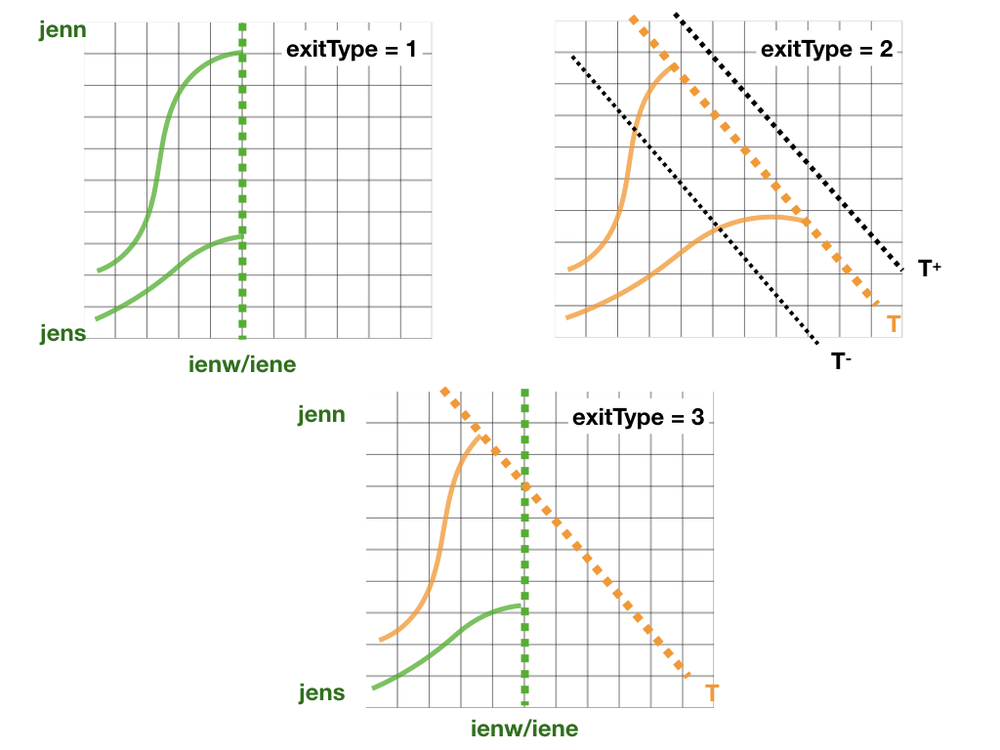

The *Projects* folder
=====================

The present chapter will introduce all the files in the *projects* folder. Currently four projects are available: **Theoretical, NEMO, AVISO, IFS, ROMS**.

setup_grid.F90
--------------

This subroutine defines the grid of the GCM. It is run once
before the main loop in TRACMASS starts.

The following variables are initialised in this subroutine:

* **dxdy** [*mandatory*]: the area of horizontal cell-walls.

* **dxv**:  size of the zonal wall computed in V points.

* **dyu**:  size of the meridional wall computed in U points.

* **kmt**: number of vertical level from surface to bottom topography.

* **dzu**: size of the vertical wall computed in U points.

* **dzv**: size of the vertical wall computed in V points.

* **dzt** [*mandatory*]: size of the vertical wall computed in T points.

.. warning::
     **dzt** is a mandatory variable that needs to be defined either in **setup_grid.F90** or in **read_field.F90**.

read_field.F90
--------------

This subroutine reads velocities and optionally some tracers from netCDF files and computes the mass/volume fluxes for TRACMASS.

There are two kind of variables that are stored at different time steps: 2-step variables and 3-step variables:

* The 2-step variables are those used to compute the time interpolation in between two time steps. These variables include all the mass/volume fluxes, tracer values, grid mass/volume tendecies, or scale factors. These variables have two time steps that represent: the "previous" time step (1) and the "current" time step (2). The data is read and stored in index **2**, in the following time step the subroutine **swap_time** will reassign the former "current" time step into the new "previous" time step.

  .. image:: figs/fig_swap_1.png
      :width: 600px
      :align: center
      :height: 300px
      :alt: Description of how the reading of fields work (2 step variables).

* The 3-step variables are those used to compute the mass/volume change **dzdt**. These variables include the size of the vertical grid **dzt**, surface boundary **hs**, or the tracer value **tracertraj**. These variables have there time steps that represent: the "previous" time step (-1), the "current" time step (0), and the "next" time step (1). The data is read and stored in index **1**, in the following time step the subroutine **swap_time** will reassign the former "current" time step into the new "previous" time step, and the former "next" into the new "current" time step. In the first iteration of TRACMASS (**ints** equals to zero) the three time steps are read.

  .. image:: figs/fig_swap_2.png
      :width: 600px
      :align: center
      :height: 300px
      :alt: Description of how the reading of fields work (3 step variables).

The following variables are initialised in this subroutine:

    * **uflux** [*mandatory*, 2-step variable]: zonal volume/mass flux.

    * **vflux** [*mandatory*, 2-step variable]: meridional volume/mass flux.

    * **dzt** [*mandatory*, see warning in **setup_grid**, 3-step variable]: size of the vertical wall computed in T points.

    * **dzdt** [2-step variable]: time derivate of the vertical grid.

    * **tracers(:)%data** [2-step variable] and **tracertraj** [3-step variable]: tracer values if **l_tracers** is **TRUE**.

kill_zones.F90
--------------

This subroutine defines the limits of the domain. If a trajectory is outside the domain the subroutine will identify it with a flag (**nend**). **nend** = 0 is reserved to the time exceeding case and **nend** = 1 is reserved to the trajectories reach the surface (**z1** == **km**).

There are four types of killing zones defined by **exitType** :

* **exitType=1** : killing zone defined by a geographical domain given by [ **iene, ienw** ]x[ **jens, jenn** ]. If a trajectory is within those indexes it will be terminated.

* **exitType=2** : killing zone defined by a tracer value **tracere**. If **maxormin** = 1 (-1) the isoline is the maximum (minimum) value of the tracer.

* **exitType=3** : killing zone defined by both a geographical domain and tracer isolines.

* **exitType=4** : the killing zone is hard coded by the user.

Makefile.prj
------------

This makefile sets the chosen pre-processing options. Before compiling the main program make sure to check the pre-processing options.

This is a list of the current pre-processing options:

  +----------------+------------------------------------------------+
  | **w_2dim**     | Turn off vertical fluxes                       |
  +----------------+------------------------------------------------+
  | **w_3dim**     | Compute 3D vertical velocities                 |
  +----------------+------------------------------------------------+
  | **w_explicit** | Read 3D vertical velocities from input files   |
  +----------------+------------------------------------------------+
  | **no_netcdf**  | Run TRACMASS without netcdf libraries          |
  +----------------+------------------------------------------------+
  | **A_grid**     | Original dataset on a A grid                   |
  +----------------+------------------------------------------------+

Namelist
--------

Many variables at TRACMASS can be modified using the namelist without the need to recompile the program. Each project has a *namelist_CASE.in* in the project folder. When TRACMASS is compiled a copy of the namelist (*namelist.in*) can be found in the main TRACMASS directory.

This is a list of all the variables that can be changed in the namelist and their corresponding group.

INIT_GRID_DESCRIPTION
^^^^^^^^^^^^^^^^^^^^^

* **griddir** [*integer, array*]: the direction of the input data indexes referenced to the TRACMASS reference system. It's a three element array; the first element corresponds to the zonal direction, the second one to the meridional direction and the third one to the vertical direction. Two possible values are possible (1) eastward/northward/upward or (-1) westward/southward/downward. The default values are **[1,1,1]**.

* **zeroindx** [*logical*]: the first index in the original dataset is given by zero instead of one. The default value is **FALSE**.

* **trunit** [*real*]: constant to scale the TRACMASS transports.

* **l_onestep** [*logical*]: read one time step per input file. The default value is **FALSE**.

* **physDataDir** [*character*]: path to the input data directory.

* **physPrefixForm** [*character*]: prefix of the input data file name.

* **dateFormat** [*character*]: part of the input data name that will be corrected by the subroutine **filledFileName**.

* **tGridName** [*character*]: the suffix for T grid files.

* **uGridName** [*character*]: the suffix for U grid files.

* **vGridName** [*character*]: the suffix for V grid files.

* **fileSuffix** [*character*]: describes the file format of the input files such as 'nc' or 'nc4'.

* **hs_name** [*character*]: variable name for surface height/pressure, etc.

* **ueul_name** [*character*]: variable name for zonal velocity.

* **veul_name** [*character*]: variable name for meridional velocity.

* **usgs_name** [*character*]: variable name for subgrid zonal velocity. The default value is **' '**.

* **vsgs_name** [*character*]: variable name for subgrid meridional velocity. The default value is **' '**.

* **usub_name** [*character*]: variable name for secondary subgrid zonal velocity. The default value is **' '**.

* **vsub_name** [*character*]: variable name for secondary subgrid meridional velocity. The default value is **' '**.

* **w_name** [*character*]: variable name for vertical velocity. The default value is **' '**.

INIT_GRID_SIZE
^^^^^^^^^^^^^^

* **imt** [*integer*]: number of global i points.

* **jmt** [*integer*]: number of global j points.

* **km** [*integer*]: number of global k points.

* **nst** [*integer*]: number of time levels to use. The default values is **2**.

* **iperio** [*integer*]: zonal boundary conditions. Two possible values: (0) no zonal boundary condition or (1) zonal conditions is on. The default values is **0**.

* **jperio** [*integer*]: meridional boundary conditions. Two possible values: (0) no meridional boundary condition or (1) meridional condition is on. The default values is **0**.

* **topoDataDir** [*character*]: path to the directory that contains mesh or topography data.

* **hgridFile** [*character*]: name of the file that contains variables linked to horizontal grid data.

* **dy_name** [*character*]:  variable name for dy in T points.

* **dyu_name** [*character*]:  variable name for dy in U points.

* **dx_name** [*character*]:  variable name for dx in T points.

* **dxv_name** [*character*]:  variable name for dx in V points.

* **zgridFile** [*character*]: name of the file that contains variables linked to vertical grid data.

* **dzt_name** [*character*]:  variable name for dz in T points.

* **dzu_name** [*character*]:  variable name for dz in U points.

* **dzv_name** [*character*]:  variable name for dz in V points.

* **dep_name** [*character*]:  variable name for total depth.

* **bathyFile** [*character*]: name of the file that contains variables linked to bathymetry/topography.

* **kmt_name** [*character*]:  variable name for bathymetry.

INIT_GRID_SUBDOMAIN
^^^^^^^^^^^^^^^^^^^

* **l_subdom** [*logical*]:  activate a subdomain. Default value is **FALSE**.

* **imindom** [*integer*]:  index that represents the western boundary of the subdomain.

* **imaxdom** [*integer*]:  index that represents the eastern boundary of the subdomain.

* **jmindom** [*integer*]:  index that represents the southern boundary of the subdomain.

* **jmaxdom** [*integer*]:  index that represents the northern boundary of the subdomain.

INIT_GRID_TIME
^^^^^^^^^^^^^^

* **ngcm_step** [*integer*]:  number of time steps between two time levels.

* **ngcm_unit** [*integer*]:  unit of the time step: (1) seconds, (2) minutes, (3) hours, (4) days, (5) months, and (6) years.

* **iter** [*integer*]:  number of subcycles between time levels.

INIT_START_DATE
^^^^^^^^^^^^^^^

* **startSec** [*integer*]:  starting second.

* **startMin** [*integer*]:  starting minute.

* **startHour** [*integer*]:  starting hour.

* **startDay** [*integer*]:  starting day.

* **startMonth** [*integer*]:  starting month.

* **startYear** [*integer*]:  starting year.

* **noleap** [*logical*]:  if FALSE a calendar with leap years is used. Default value is **TRUE**.

INIT_RUN_TIME
^^^^^^^^^^^^^

* **loopYears** [*logical*]:  make a loop over two dates to run. Default value is **FALSE**.

* **loopStartYear** [*integer*]:  starting year of the loop.

* **loopEndYear** [*integer*]:  last year of the loop.

* **log_level** [*integer*]: level of verbose.

* **intrun** [*integer*]: number of time steps to run.

INIT_WRITE_TRAJ
^^^^^^^^^^^^^^^

* **write_frec** [*integer*]: output writing frequency: (1) write at time intervals of gcm datasets (each ints), (2) write at each time iteration, (3) write each spatial grid-crossing, (4) write at all time steps, and (5) write only start and end positions.

* **write_form** [*integer*]: output writing format: (0) two decimals, (1) five decimals. Default values is zero.

* **outDataDir** [*character*]:  path to the directory where the output files are stored.

* **outDataFile** [*character*]: prefix of the output file.

* **timeformat** [*integer*]: format of the time array: (0) seconds from the starting date, (1) time fraction, or (2) date and time format.

INIT_SEEDING
^^^^^^^^^^^^

* **nff** [*integer*]: time arrow of TRACMASS: (1) run forward trajectories and (-1) backward trajectories.

* **isec** [*integer*]: seeding section (1) zonal wall, (2) meridional wall, and (3) vertical wall.

* **idir** [*integer*]: direction of initial fluxes (1) only positive fluxes are seeded, and (-1) only negative fluxes are seeded.

* **nqua** [*integer*]: defines how many particles are initiliased per grid cell (1) constant number set by **partQuant**, (2) all trajectories reflect the same transport set by **partQuant**.

* **partQuant** [*integer*]:  number of trajectories per grid cell (if nqua is one) or the mass/volume transport per trajectory (if nqua is two).

* **loneparticle** [*integer*]: trajectory number to run a lonely trajectory. The default value is set to zero (run all trajectories).

* **SeedType** [*integer*]: defines the seeding type (1) using a seeding box defined by ist,jst,kst, or (2) using indexes from a file.

* **ist1** and **ist2** [*integer*]: define the first and last zonal index of the seeding box (seedType=1)

* **jst1** and **jst2** [*integer*]: define the first and last meridional index of the seeding box (seedType=1)

* **kst1** and **kst2** [*integer*]: define the first and last vertical index of the seeding box (seedType=1)

* **seeddir** [*character*]: path to the directory where the seeding file is stored (seedType=2).

* **seedfile** [*character*]: name of the seeding file (seedType=2).

* **maskfile** [*character*]: name of the masking file (seedType=1).

* **seedTime** [*integer*]: defines the time seeding type (1) using a time range, or (2) using indexes from a file.

* **tst1** and **tst2** [*integer*]: defines the first and last time steps to seed trajectories (seedTime=1).

* **timeFile** [*character*]: name of the time seeding file (seedTime=2).

INIT_TRACERS
^^^^^^^^^^^^

* **l_tracers** [*logical*]:  activate tracers. Default value is **FALSE**.

* **l_swtraj** [*logical*]: activate salt/water trajectories. Default value is **False**.

* **tracertrajscale** [*real*]: scale factor applied on the tracer which is used to compute salt/water trajectories. Default value is one.

* **tracername** [*character, array*]: name of the tracers.

* **tracerunit** [*character, array*]: tracer units.

* **tracervarname** [*character, array*]: variable name of the tracer.

* **traceraction** [*character, array*]: action associated to the variable 'read' or 'compute'.

* **tracermin** [*real, array*]: minimum value of the tracer used to define the tracer coordinate space when stream functions are computed.

* **tracermax** [*real, array*]: maximum value of the tracer used to define the tracer coordinate space when stream functions are computed.

* **tracerdimension** [*character, array*]: defines the number of dimensions of the tracer, '2D' or '3D'.

INIT_TRACERS_SEEDING
^^^^^^^^^^^^^^^^^^^^

* **tracer0min** [*real, array*]: minimum value of the tracer to be seeded. The default values is -9999.

* **tracer0max** [*real, array*]: maximum value of the tracer to be seeded. The default values is 9999.

INIT_KILLZONES
^^^^^^^^^^^^^^

* **timax** [*real*]: time limit before trajectories are terminated, calculated in days.

* **exitype** [*integer*]: selects the type of killing zones (1) defined by a regular box, (2) defined by a tracer value, (3) a combined tracer-geographical zone, and (4) hard coded killing zone.

* **ienw** and **iene** [*integer, array*]: define the western and eastern index of the killing zone (exitType=1).

* **jens** and **jenn** [*integer, array*]: define the southern and northern index of the killing zone (exitType=1).

* **tracerchoice** [*integer, array*]: defines the tracers that are used to defined the killing zone (exitType=2 or exitType=3). The index is given by the order of the tracer in **tracername**.

*  **tracere** [*real, array*]: value of the tracer that defines the killing zone (exitType=2 or exitType=3).

*  **maxormin** [*integer, array*]: sets the value of **tracere** to a (1) maximum or (-1) minimum value.

INIT_STREAMFUNCTION
^^^^^^^^^^^^^^^^^^^

* **l_psi** [*logical*]: activate stream function calculation.

* **l_offline** [*logical*]: compute the stream functions offline. Default value is **True**.

* **dirpsi** [*integer, array*]: direction of integration of streamfunctions.

* **xyflux** [*integer*]: compute barotropic fluxes using **uflux** (1) or **vflux** (2). Default value is **1**.
